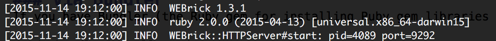
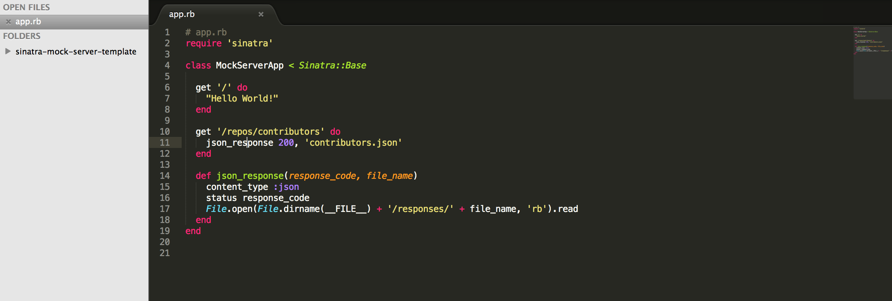

### Sinatra Mock Server Base

## Requirements
- Ruby (v2.0+)
- Bundler

## Dependencies
- Rack (web server middleware)
- Sinatra (web server framework)

## Setup

### via Bundler
If you have Bundler (the Ruby gem for installing Ruby gem libraries via a Gemfile):

<code>bundle install</code>

### Manual setup

Otherwise install the following libraries:

<code>gem install rack</code>

<code>gem install sinatra</code>

### Troubleshooting
- If you have permissions issues installing then a quick fix is to run the commands as root user e.g. <code>sudo gem install rack</code> and <code>sudo gem install sinatra</code>

## Usage

Open a terminal and start the web server:

- <code>cd sinatra-mock-server-template/</code>
- <code>rake</code>

You should see an output similar to this:

The server is now bound to your local IP address, making also possible to point devices to it.

## Updating the API

- Edit the <code>App.rb</code> and add new endpoints matching the URLs you want to mock
- Add sample json responses in the <code>responses</code> folder

You can updated the responses and endpoints target this local server in automated tests for your mobile applications. 🎉

Visit <code>http://YOUR_IP:9292/repos/contributors/</code> to see sample mock JSON response.
